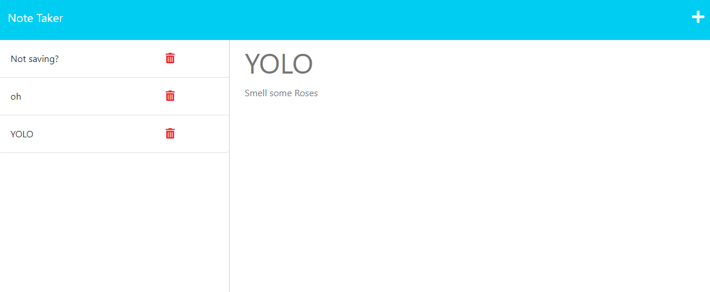

    
# Express_NoteTaker

## Table of Contents
* [Project Description](#description)
* [Installation](#install)
* [Contribution Notes](#contribution)
* [Usage Info](#usage)
* [Test Info](#test)
* [Contact Info](#contact)
* [Deployed Link](#deployed)
* [Screenshot](#screenshot)

## Description
A simple app that utilizes NPM package Express to create backend storage on localhost from user input via HTML

## Install
NPM package Express, FS, path a webbrowser and internet access

## Contribution
Please review package-lock.json

## Usage
Public

## Test
NaN

## Contact
If you have any Questions or concerns please reach me via my E-mail or through GitHub  
rasvindra@hotmail.com  
[github.com/rasvindra](https://github.com/rasvindra)

## Deployed
https://rsn-express-notetaker.herokuapp.com/notes

## Screenshot

